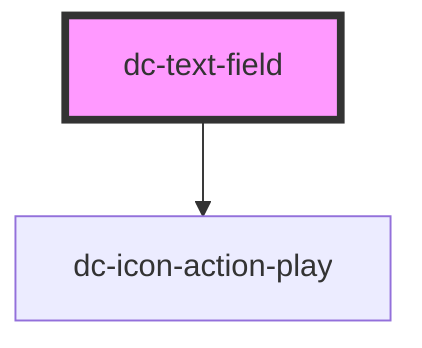

# text-field

<!-- Auto Generated Below -->

## Properties

| Property | Attribute | Description     | Type     | Default     |
| -------- | --------- | --------------- | -------- | ----------- |
| `label`  | `label`   | The first name  | `string` | `undefined` |
| `value`  | `value`   | The middle name | `string` | `undefined` |

## Dependencies

### Depends on

- [dc-icon-action-play](../icons/action-play)

### Graph

----------------------------------------------

*Built with [StencilJS](https://stenciljs.com/)*
